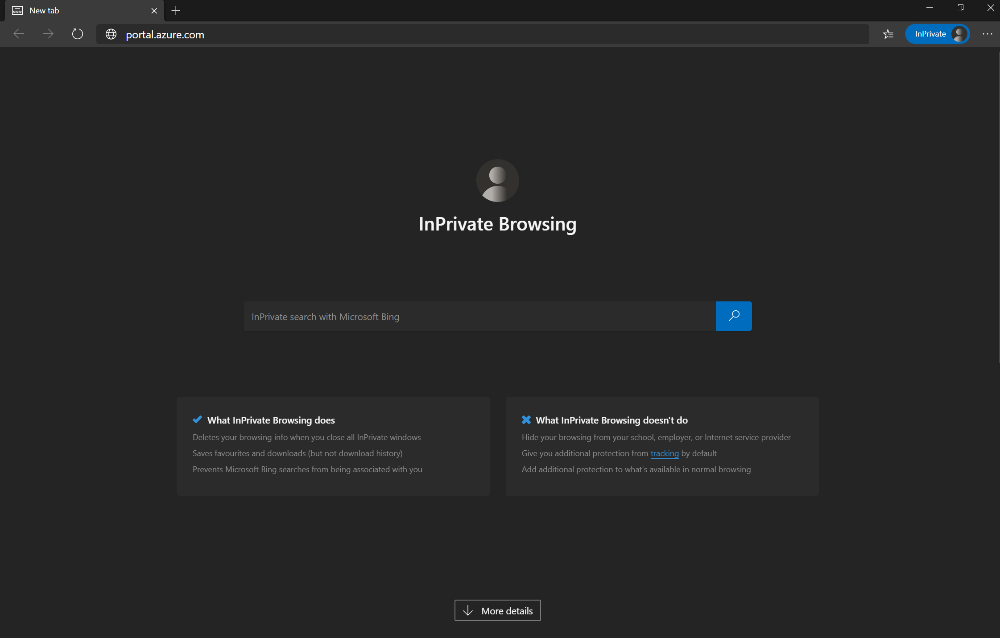
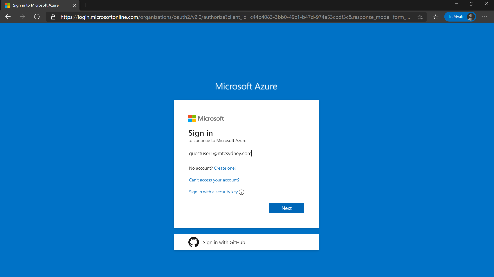
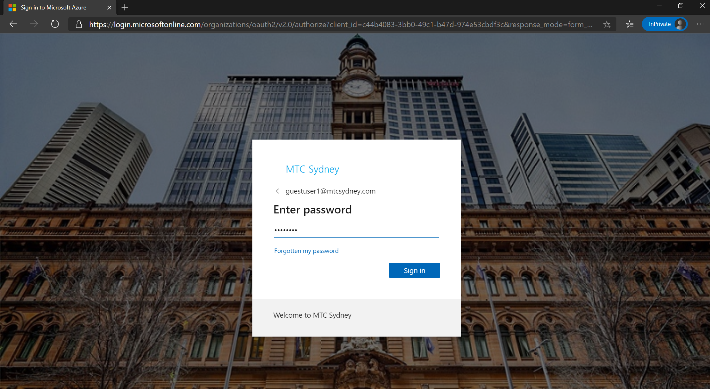
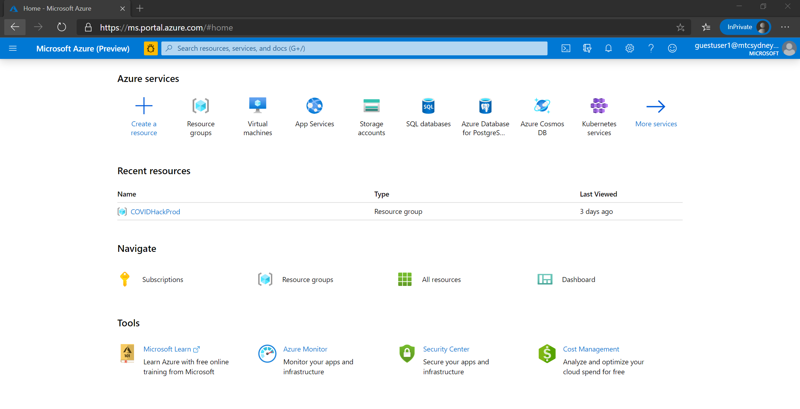
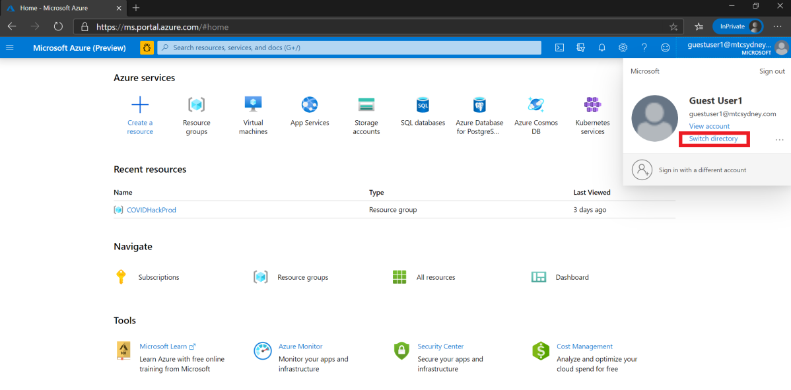
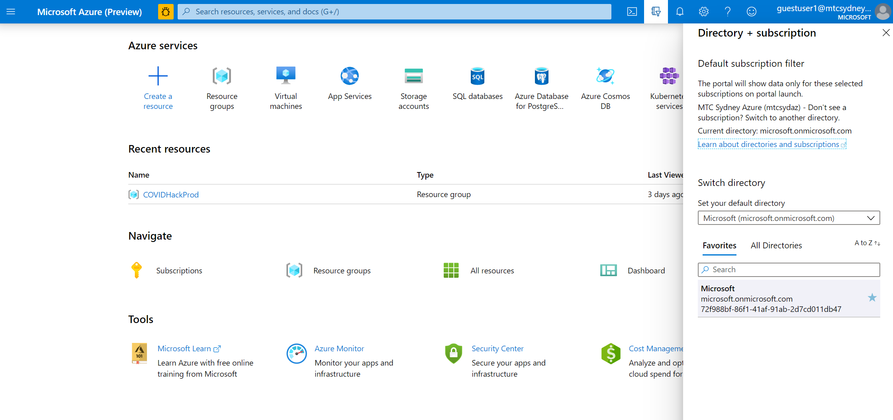
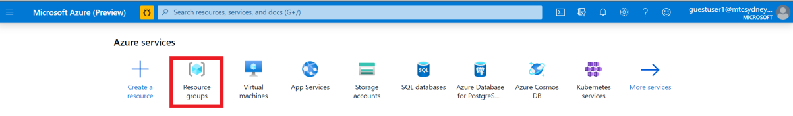
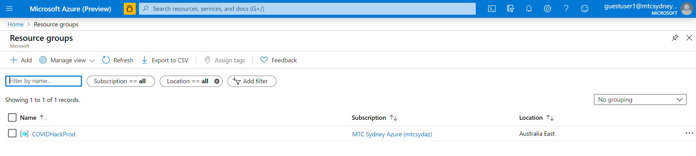

Hands On Lab

Pre-Requirements

Azure Portal Access & Power BI Desktop

# Accessing the Azure Portal

1.  Open a private window in your browser and navigate to
    **portal.azure.com**

2.  Enter your respective guest credentials on the login screen
    (**guestuserX@mtcsydney.com**)

3.  Enter the password in the given field.

4.  After verifying your credentials, you will be directed to the Azure
    Portal Home page as shown below.

5.  To verify that you are using the correct directory, navigate to the
    profile icon and click **Switch directory.**

6.  In the **Directory + subscription** panel ensure you select
    **Microsoft** as your directory. Close the panel once you have
    selected your directory.

7.  Next, click on **Resource groups.**

8.  Verify that you have access to the **COVIDHackProd** resource group
    that you will be utilising throughout the Data Platforms Workshop.

# Power BI Desktop

Please install Power BI Desktop from the Microsoft Store or [from
here](https://powerbi.microsoft.com/en-us/desktop/).

If you have access to Power BI Online through your organization, you
will be able to use you’re the credentials provided by your organization
to sign in from the desktop tool. This will let you publish and share
your dashboards.
