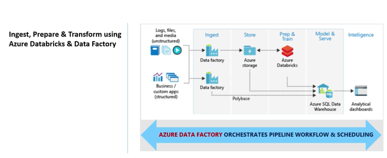
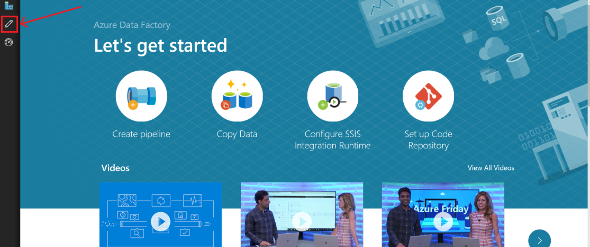
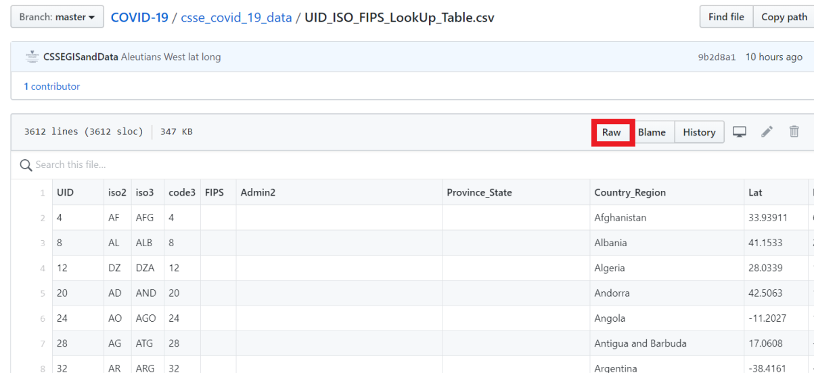
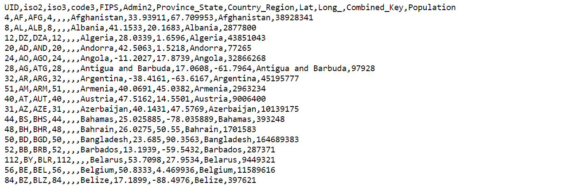
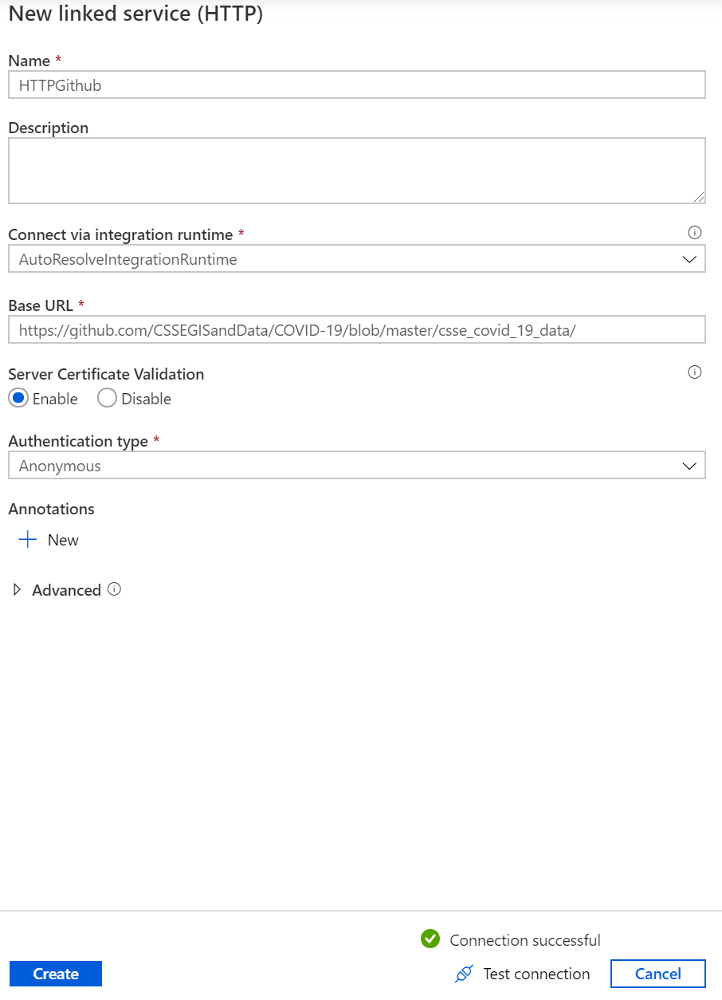
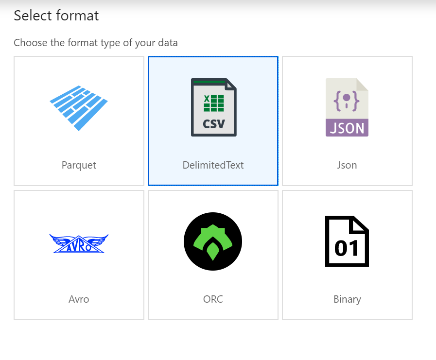
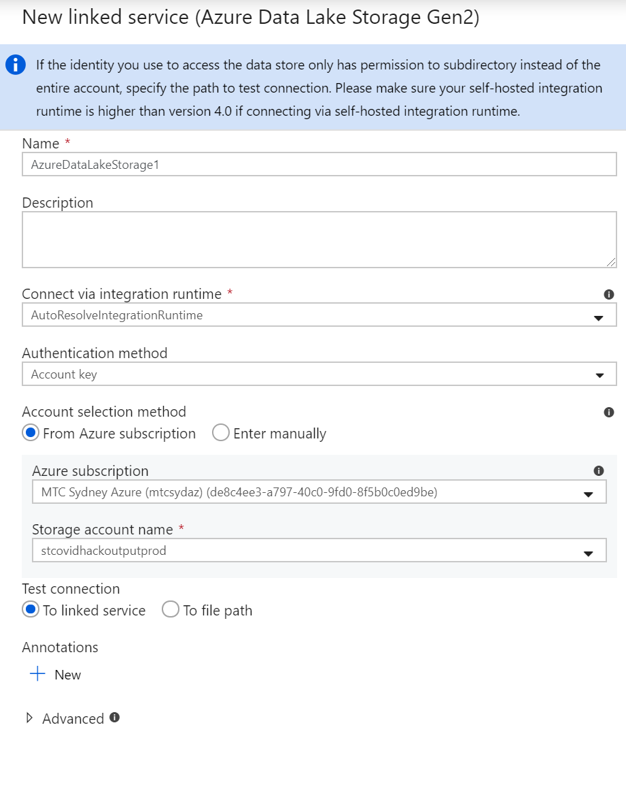
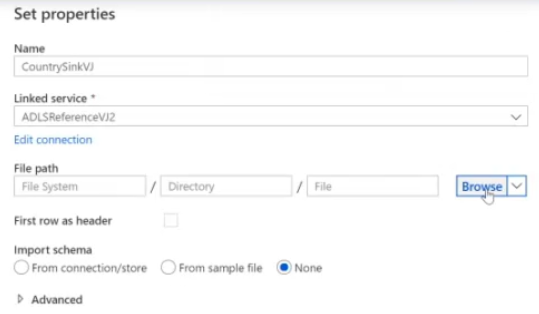
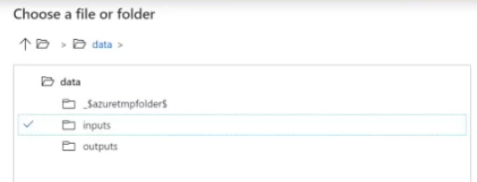
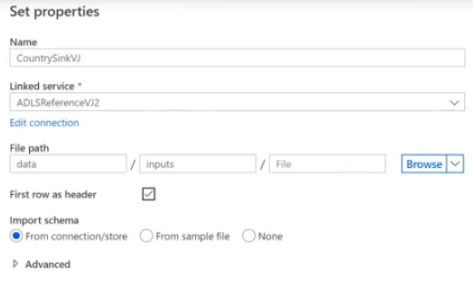

Hands On Lab

MODULE I: DATA INGESTION

Country Code Data

**MODULE 1:**

Data Ingestion with Azure Data Factory

# Objective 1 – Create a Pipeline to Copy the Country Codes Data Set to the Data Lake

**Learning Outcomes for Module 1:**

  - Importing Country Code Data from Github

  - Creating a linked service to link your Azure Storage account to the
    data factory. The linked service has the connection information that
    the Data Factory service uses at runtime to connect to it

  - Creating and validating a pipeline to copy the country code data to
    Azure Data Lake

# 

**Pre-requisites:**

  - Azure subscription with Azure Data Factory Instance

<!-- end list -->

1.  On the **Let's get started** page,
    switch to the **Edit** tab in the left panel.

2.  The first thing we need to do is **create a folder** for all our
    resources and work. Under the **pipeline** section, click the
    **three dots** for more actions and **create new folder.**

> 

3.  Next, **create a new pipeline**. Select the **plus (+)** button and
    click on pipeline. This is going to be a data pipeline to copy stuff
    across

4.  In the **general** tab, specify the **pipeline name** i.e.
    DataCopy\<Name\>. You will see the name of your pipeline appear on
    the left hand panel under Factory Resources. Drag and drop your
    pipeline from the left hand panel to the folder we created in the
    first step.

5.  Next, click on the **move and transform** section and drag the
    **‘copy data’** function and rename it to be ‘CopyCountryCodeData’
    in the **General** panel.

6.  The Country Code data we are going to be working with in this module
    can be found here:
    <https://github.com/CSSEGISandData/COVID-19/blob/master/csse_covid_19_data/UID_ISO_FIPS_LookUp_Table.csv>

Open this link in a new tab and click the ‘**raw’** button to see this
file in csv format.

7.  Back in the Azure portal, we are going to **create a new source**.
    Click on the **source tab** and select the **(+)** button to **add a
    new dataset.**

8.  On the New Dataset panel on the right hand side, select ‘**HTTP’**
    and click continue.

9.  Given our raw data from Github is in a csv file click the
    **DelimitedText** option and click Continue.

10. In the **Set Properties** panel rename the file to
    ‘CountryCodeData’.

11. Select the ‘**first row as header’** option.

12. Under the **Linked Service** heading click ‘**new’**.

13. **Name** the linked service to ‘HTTP\<Name\>Github

14. **Copy** the **base URL** of the raw Github csv file:
    <https://github.com/CSSEGISandData/COVID-19/blob/master/csse_covid_19_data/>

15. Set **Authentication** type to **Anonymous**

16. Click **Test connection** to verify that the connection is
    successful.

17. Click **Create**.

18. On the Set Properties Page enter **Name** as CountryCode

19. Select HTTP\<Name\>Github as **Linked service**

20. Input the **relative URL** of the raw Github csv file:
    UID\_ISO\_FIPS\_LookUp\_Table.csv

21. Select **first row as header**

22. Click **OK.**

23. Select Preview Data

24. On the Data storage read settings page select **Finish**.

25. Verify that a preview of your data is displayed as shown below.

26. Select the **Sink** tab and click **(+) New**

27. Select Azure Data Lake Storage Gen2

28. Select Format as Delimited Text

29. Set **Name** as ‘CountryCodeDL\<Name\>

30. Select **first row as header**

31. Click **new Linked Service**

32. Input Azure subscription as shown below

33. Input Storage account name as shown below

34. Click **Continue**

35. On the **Set Properties** page select **Browse** under the File Path
    heading

36. Select **data**, then **inputs** as shown below. Click OK.

37. Select first row as header and click OK.

38. Next click **Validate all**

39. Once validated, click **Publish all**

40. Next, click **add trigger**, and click **trigger now**

41. Verify that the pipeline has successfully run through the storage
    group.

We have successfully created the Covid Country Data Pipeline. This
process will be repeated twice more to create the remaining pipelines to
be ingested: Covid Dataset and GHO Doctor Count.
