Hands On Lab

MODULE I: DATA INGESTION

COVID-19 Dataset

**MODULE 1:**

Data Ingestion with Azure Data Factory

# Objective 2 – Create a Pipeline to Copy Daily COVID-19 Data with Parameters to the Data Lake 

**Pre-requisites:**

  - Azure subscription with Azure Data Factory Instance

  - Completed Objective 1 of Module 1: Creating a pipeline to copy
    country code dataset to the Azure Data Lake

**Learning Outcomes for Module 1:**

  - Importing COVID-19 Data from Github

  - Creating a linked service to link your Azure Storage account to the
    data factory. The linked service has the connection information that
    the Data Factory service uses at runtime to connect to it

  - Creating and validating a pipeline with specified parameters to copy
    the COVID-19 data to Azure Data Lake

<!-- end list -->

1.  Create a new pipeline through selecting the **plus (+)** button and
    click on **Pipeline**

2.  In the **general** tab, specify the **pipeline name** i.e. Covid
    Latest Pipe. You will see the name of your pipeline appear on the
    left hand panel under Factory Resources.

3.  We are working with the daily reports dataset in this section, in
    which a new file is created everyday. We must therefore define a
    **parameter** for our pipeline pertaining to the file date of the
    particular file we want to work with. Navigate to the **Parameters**
    tab and click **New**.

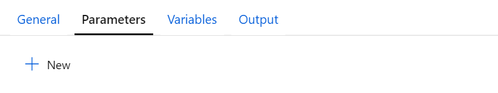

4.  Input **FileDate** as the parameter **Name**. This is the parameter
    we will use for the rest of this section.

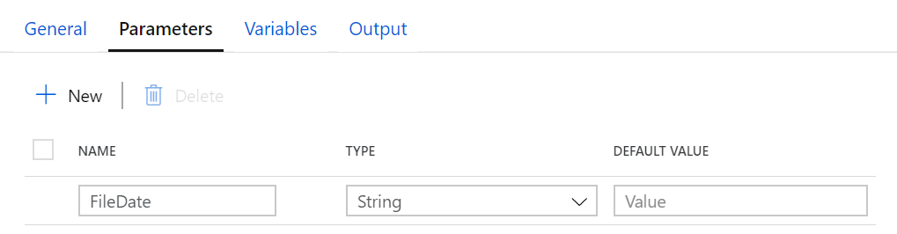

5.  Next, click on the **move and transform** section and drag the
    **‘copy data’** function and rename it to be ‘CovidDataCopy’ in
    the **General** panel.

6.  The dataset we will be working with for this module can be found
    here:
    <https://github.com/CSSEGISandData/COVID-19/tree/master/csse_covid_19_data/csse_covid_19_daily_reports>

7.  Next up, we are going to **create a new source**. Click on the
    **source tab** and select the **(+)** button to **add a new
    dataset.**

8.  On the New Dataset panel on the right hand side, select ‘**HTTP’**
    and click continue.

9.  Given our raw data from Github is in a csv file click the
    **DelimitedText** option and click **Continue**.

10. In the **Set Properties** panel rename the file to
    ‘CovidDataSource’.

11. Under the **Linked Service** heading click ‘**new’**.

12. **Name** the linked service to ‘HTTPServerReferenceLinkedService’

13. **Copy** the base URL of the raw Github csv file as shown below
    <https://raw.githubusercontent.com/CSSEGISandData/COVID-19/master/csse_covid_19_data/csse_covid_19_daily_reports/>

14. **Set authentication** to Anonymous

15. Click **Test connection** to verify that the connection is
    successful.

16. Click **Create**.

17. Click **OK**.

18. Click **Open Source dataset**

19. Navigate to the **Connection** tab. We will be adding dynamic
    content under the **Relative URL** field to refer to the file
    source.

> Before we can run the file source however, another parameter must be
> created to contain extra bits of information. Navigate to the
> **Parameters** tab, and input **FileName** in the **Name** field.
> 
> 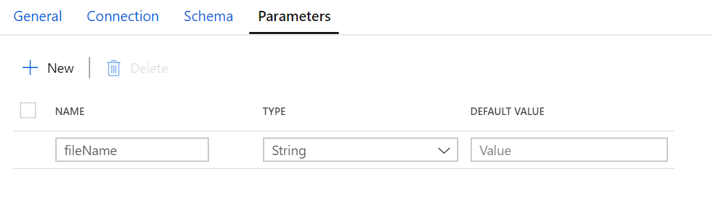

20. Navigate back to the **Connection** tab and click **Add dynamic
    content** under the Relative URL field. What we want to do here is
    get the FileDate as a csv. Input the following in the **add dynamic
    content field:**

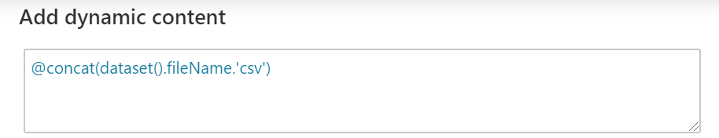

We essentially want this dynamic content to be referred to every time
the pipe is run.

21. Click **Finish**

22. Return back to your actual pipeline to test that our parameters
    work. Under the **fileName** field, we must input a value to refer
    to a specific file. This file name is going to come from the
    pipeline, here we will be using the **FileDate** parameter we
    specified at the beginning of this section. Click on **Add dynamic
    content** under the fileName field and input the following:

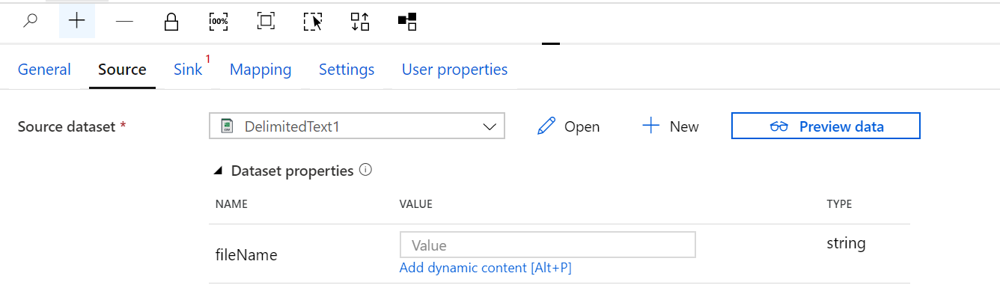

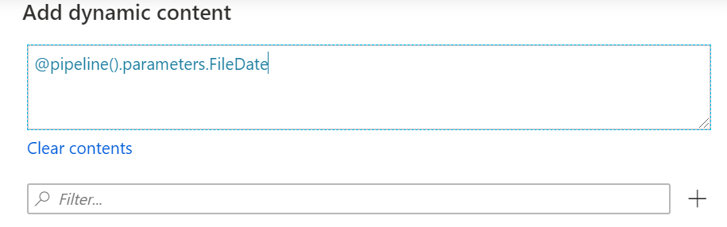

23. Click **Finish**

24. Next, click on **Preview data** and input a value for the file date
    as follows:

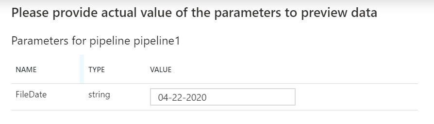

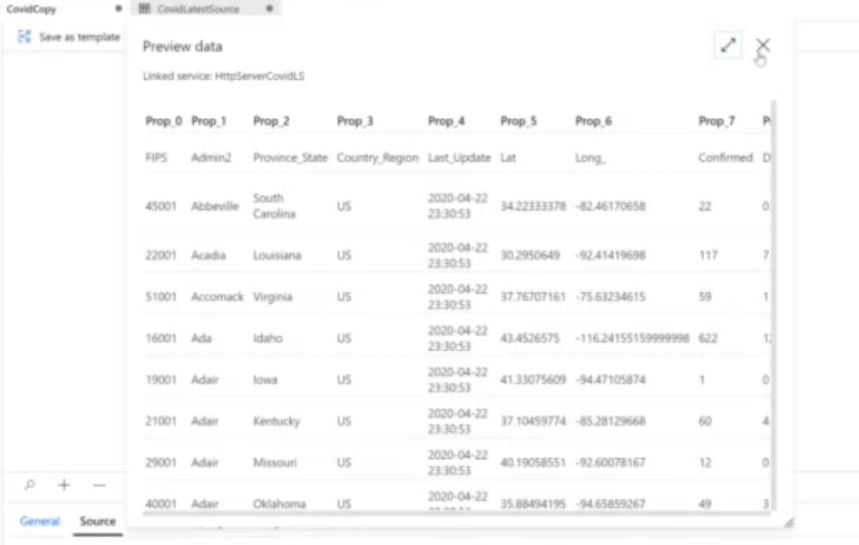

Through this process we have learnt how to use parameters to define a
file name which will eventually point to a specific file in our dataset.

25. Next up, we have to define the data lake that we want to copy this
    data to. Navigate to the **Sink** tab and click **new**.

26. Select **Azure Data Lake Storage Gen 2**

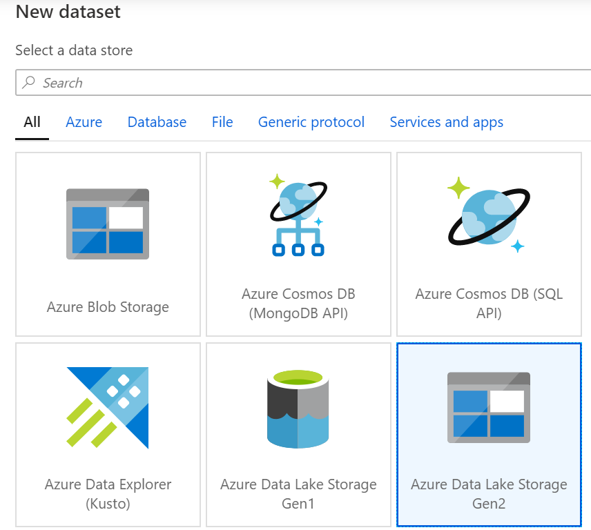

27. Select **Delimited Text**

28. Input ‘CovidLatest’ in the name field

29. Select **new linked service**

30. Input fields as shown below:

**Name**: ADLSLSReference

**Azure subscription**: MTC Sydney Azure

**Storage account name**: stcovidhackoutputprod

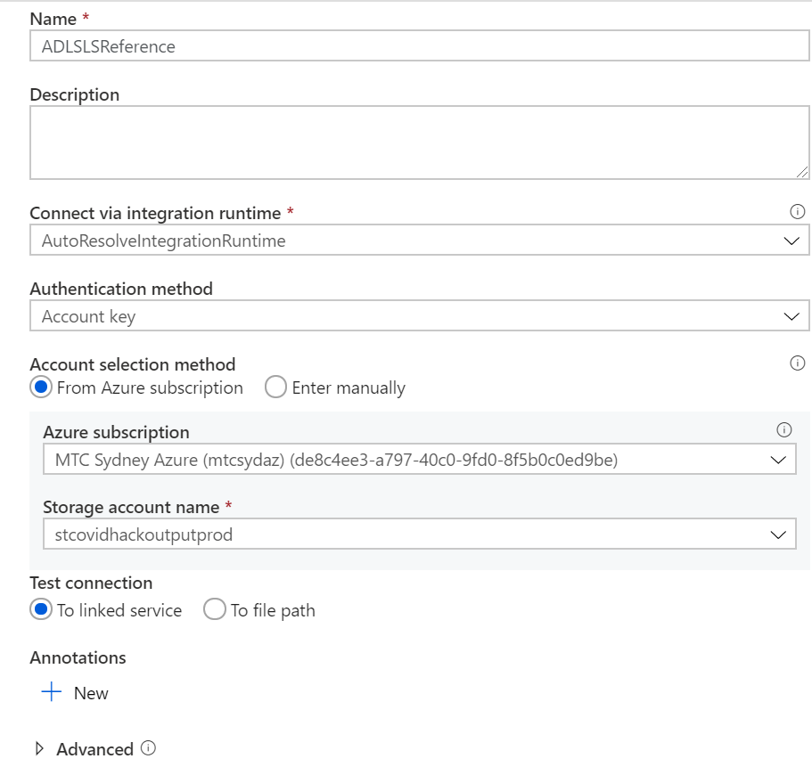

31. Click **test connection.**

32. Next, to set a **file path** click **browse**

33. Click on **data** and then select **inputs**

34. Click **OK**.

35. Click **Validate All**

36. If all the validations are correct, click **Publish All**

37. Next, click **Add trigger**

38. Click **Trigger now** to trigger the pipeline straight away. When
    prompted for a parameter, input a date value in the format of
    MM-DD-YYYY. Click OK. The pipeline will then start to run.

39. To check how the pipeline is running, go to the **monitor step** in
    Azure Data Factory.

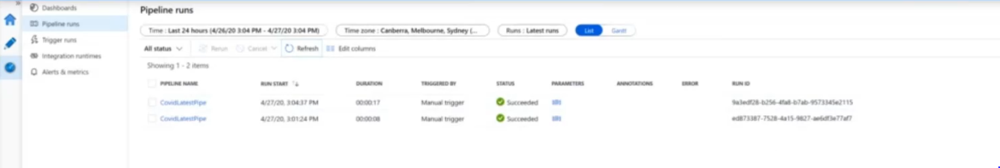
