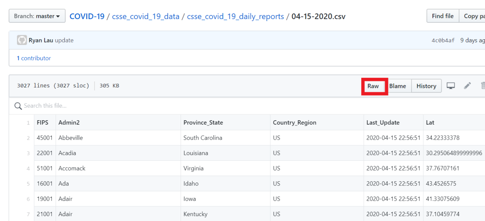
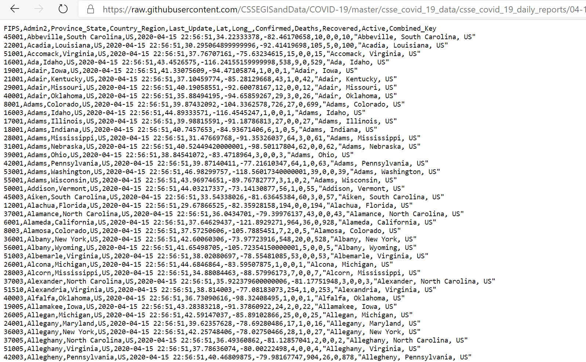
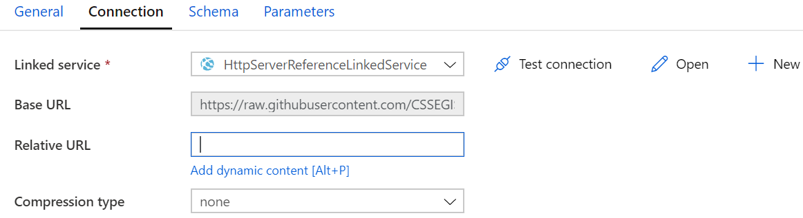
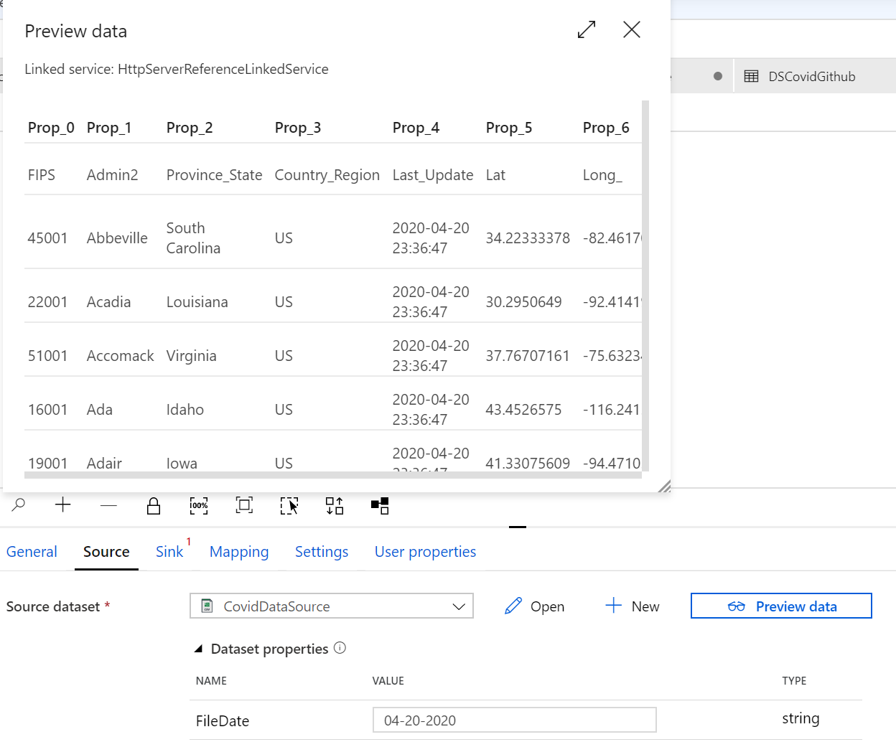
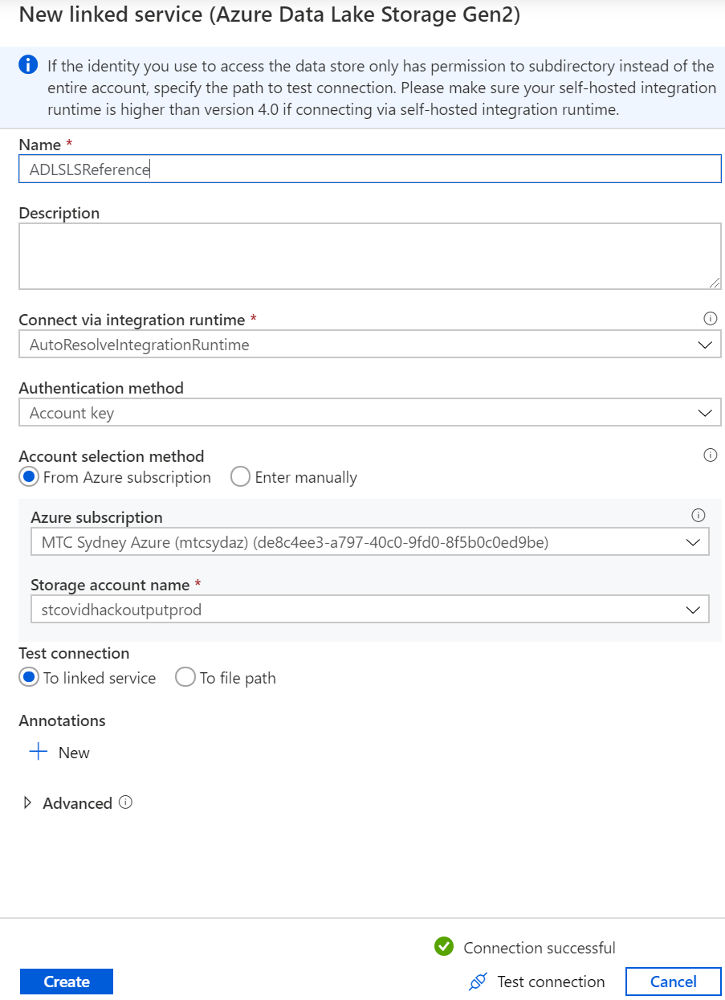
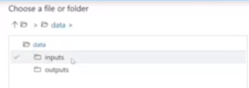

Hands On Lab

MODULE I: DATA INGESTION

COVID-19 Dataset

**MODULE 1:**

Data Ingestion with Azure Data Factory

# Objective 2 – Create a Pipeline to Copy Daily COVID-19 Data with Parameters to the Data Lake 

**Pre-requisites:**

  - Azure subscription with Azure Data Factory Instance

  - Completed Objective 1 of Module 1: Creating a pipeline to copy
    country code dataset to the Azure Data Lake

<!-- end list -->

1.  Create a new pipeline through selecting the **plus (+)** button and
    click on pipeline

2.  In the **general** tab, specify the **pipeline name** i.e. Covid
    Latest Pipe. You will see the name of your pipeline appear on the
    left hand panel under Factory Resources.

3.  Next, click on the **move and transform** section and drag the
    **‘copy data’** function and rename it to be ‘CovidDataCopy’ in
    the **General** panel.

4.  The dataset we will be working with for this module can be found
    here:
    <https://github.com/CSSEGISandData/COVID-19/tree/master/csse_covid_19_data/csse_covid_19_daily_reports>

5.  Next up, we are going to **create a new source**. Click on the
    **source tab** and select the **(+)** button to **add a new
    dataset.**

6.  On the New Dataset panel on the right hand side, select ‘**HTTP’**
    and click continue.

7.  Given our raw data from Github is in a csv file click the
    **DelimitedText** option and click Continue.

8.  In the **Set Properties** panel rename the file to
    ‘CovidDataSource’.

9.  Under the **Linked Service** heading click ‘**new’**.

10. **Name** the linked service to ‘HTTPServerReferenceLinkedService’

11. **Copy** the base URL of the raw Github csv file as shown below
    (<https://raw.githubusercontent.com/CSSEGISandData/COVID-19/master/csse_covid_19_data/csse_covid_19_daily_reports/>)

12. **Set authentication** to Anonymous

13. Click **Test connection** to verify that the connection is
    successful.

14. Click **Create**.

15. Click OK.

16. Click **Open Source dataset**

17. To ensure we pull the data with the latest date we must set a
    parameter. Navigate to the Parameters tab and click new.

18. Input ‘FileDate’ in the **name field.**

19. Navigate to the **Connection** tab. Under the **Relative URL** field
    click on **add dynamic content**, as we want to ensure we always
    pull the latest COVID-19 data.

20. What we want to do here is get the FileDate as a csv. Input the
    following in the **add dynamic content field:**
    

21. Click **Finish**

22. Return back to your actual pipeline to test that our parameters
    work. Input a file date to test, and click on **Preview data.**

23. Next up, we have to define the data lake that we want to copy this
    data to. Navigate to the **Sink** tab and click **new**.

24. Select **Azure Data Lake Storage Gen 2**

25. Select **Delimited Text**

26. Input ‘CovidLatest’ in the name field

27. Select new linked service

28. Input fields as shown below:

**Name**: ADLSLSReference

**Azure subscription**: MTC Sydney Azure

**Storage account name**: stcovidhackoutputprod

29. Click **test connection.**

30. Next, to set a **file path** click **browse**

31. Click on **data** and then select **inputs**

32. Click **OK**.

33. Click **Validate All**

34. If all the validations are correct, click **Publish All**

35. Next, click **add trigger**

36. Click **Trigger now** to trigger the pipeline straight away.

37. To check how the pipeline is running, go to the **monitor step** in
    Azure Data Factory.
