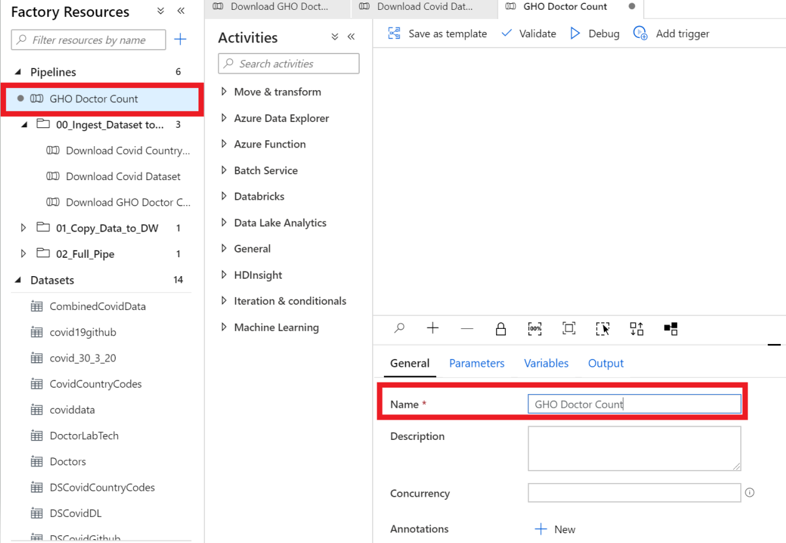
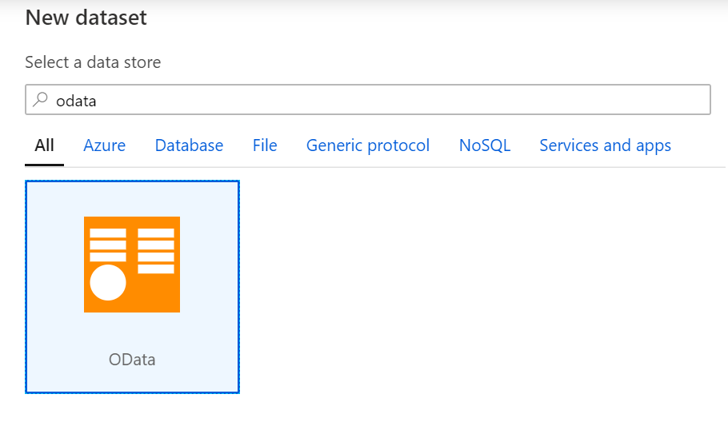
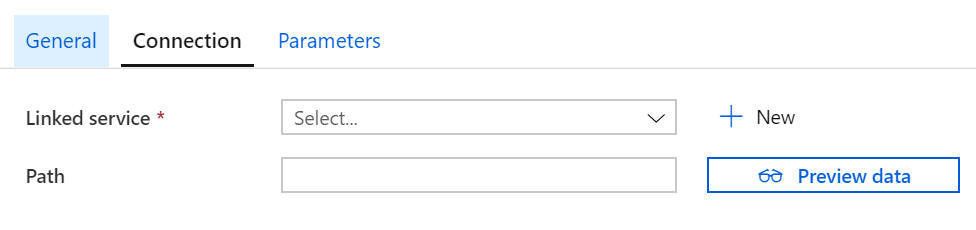
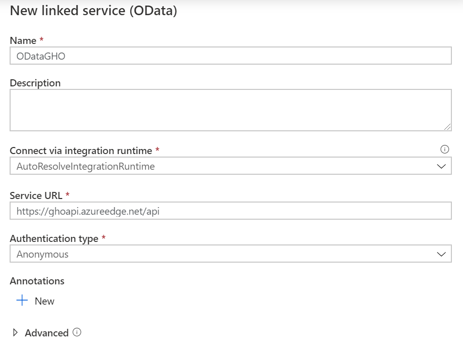
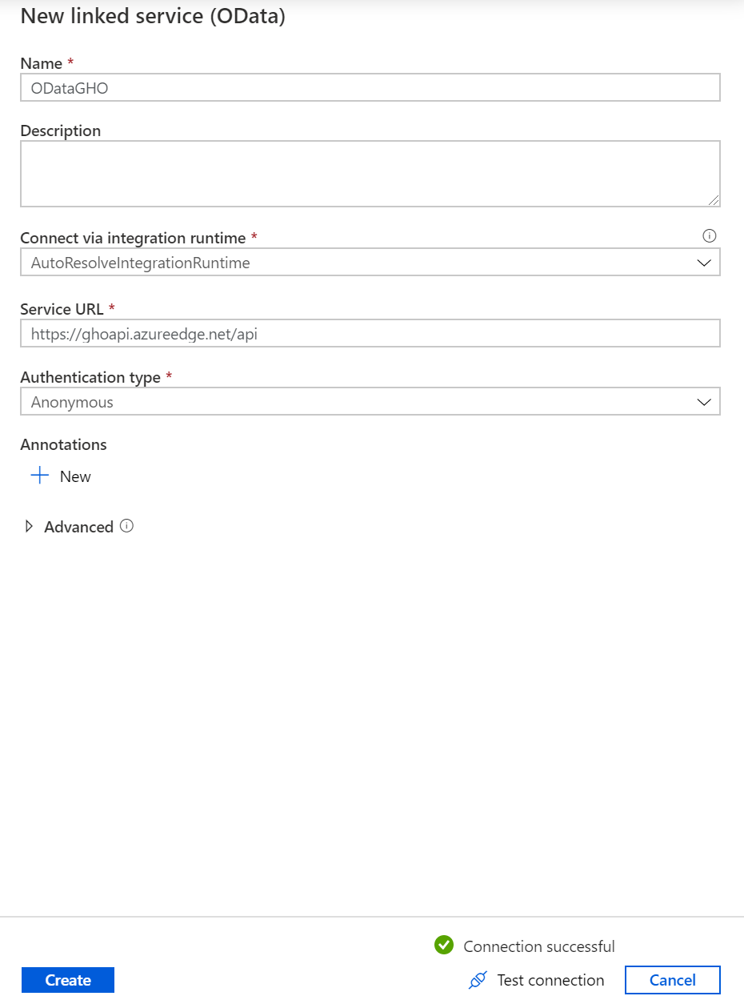
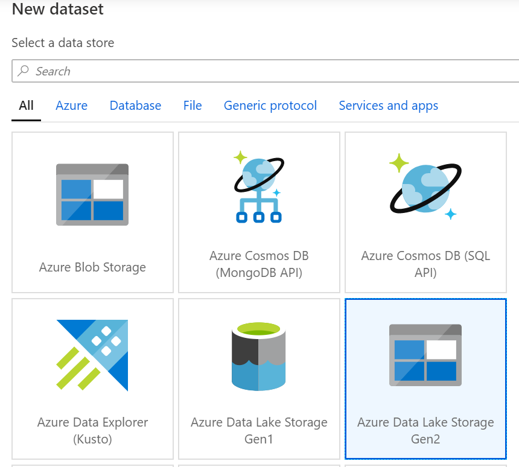
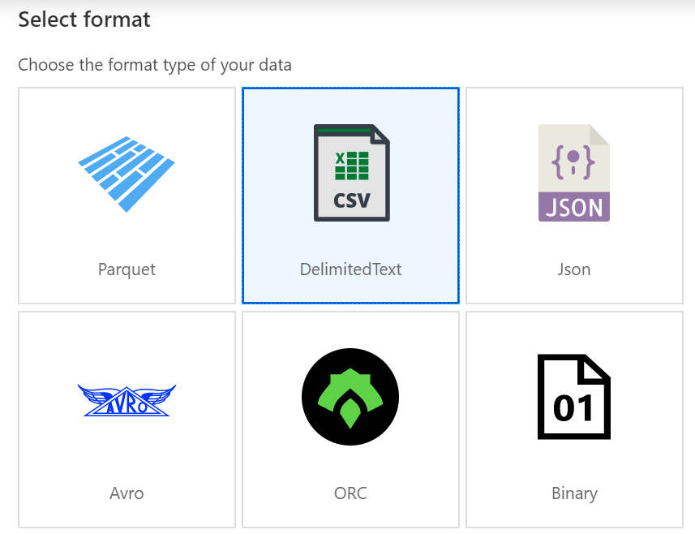
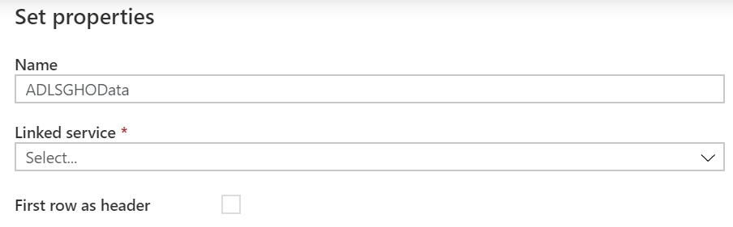
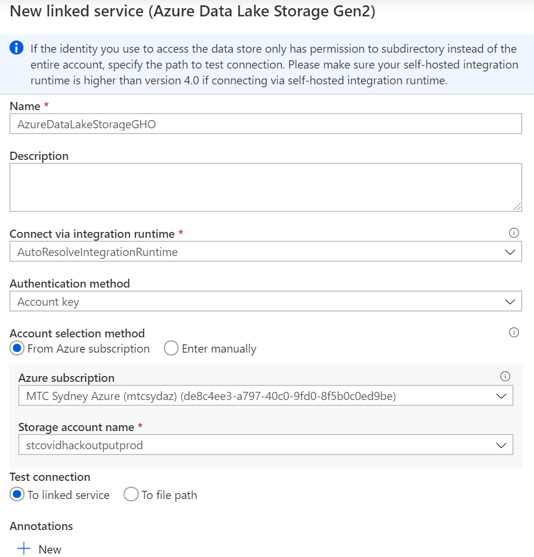
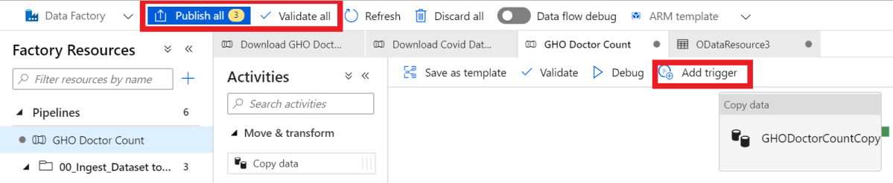

Hands On Lab

MODULE I: DATA INGESTION

Download GHO Doctor Count Data

**MODULE 1:**

Data Ingestion with Azure Data Factory

# Objective 3 – Create a Pipeline to Copy GHO Doctor Count Data to the Data Lake 

**Pre-requisites:**

  - Azure subscription with Azure Data Factory Instance

  - Completed Objective 1 of Module 1: Creating a pipeline to copy
    country code dataset to the Azure Data Lake

  - Completed Objective 2 of Module 1: Creating a pipeline to copy Daily
    COVID-19 data with parameters to the Azure Data Lake

<!-- end list -->

1.  Create a new pipeline through selecting the **plus (+)** button and
    click on pipeline

2.  In the **general** tab, specify the **pipeline name** i.e. GHO
    Doctor Count. You will see the name of your pipeline appear on the
    left hand panel under Factory Resources.

3.  Next, click on the **move and transform** section and drag the
    **‘copy data’** function and rename it to be ‘GHODoctorCountCopy’
    in the **General** panel.

4.  The dataset we will be working with for this module can be found
    here: <https://www.who.int/data/gho/info/gho-odata-api>

5.  Next up, we are going to **create a new source**. Click on the
    **source tab** and select the **(+)** button to **add a new
    dataset.**

6.  On the New Dataset panel on the right hand side, select **OData**
    and click continue.

7.  Click **Create**.

8.  Click **Open** dataset under **Source** dataset

9.  Navigate to the Connections tab and click new linked services

10. Input the following data as shown below

**Name**: ODataGHO

**Service URL**: <https://ghoapi.azureedge.net/api>

**Authentication Type**: Anonymous

11. Click **Test connection** to verify that the connection is
    successful

12. Click **Create**

13. Return back to your actual pipeline and navigate to the **Sink**
    tab.

14. Click **new**.

15. Select **Azure Data Lake Storage Gen 2** and click **Continue**.

16. Select **DelimitedText** and click **Continue**

17. Input **Name** on the **Set Properties Page**. In the **Linked
    Service** field click new.

18. Input the following data in the fields as shown below

**Azure Subscription**: MTC Sydney

**Storage account name**: stcovidhackoutputprod

19. Click **test connection** to verify the connection.

20. Click **Create**

21. Next, to set a **file path** click **browse**

22. Click on **data** and then select **inputs**

23. Click **OK**.

24. Click **Validate All**

25. If all the validations are correct, click **Publish All**

26. Next, click **add trigger**

> 
