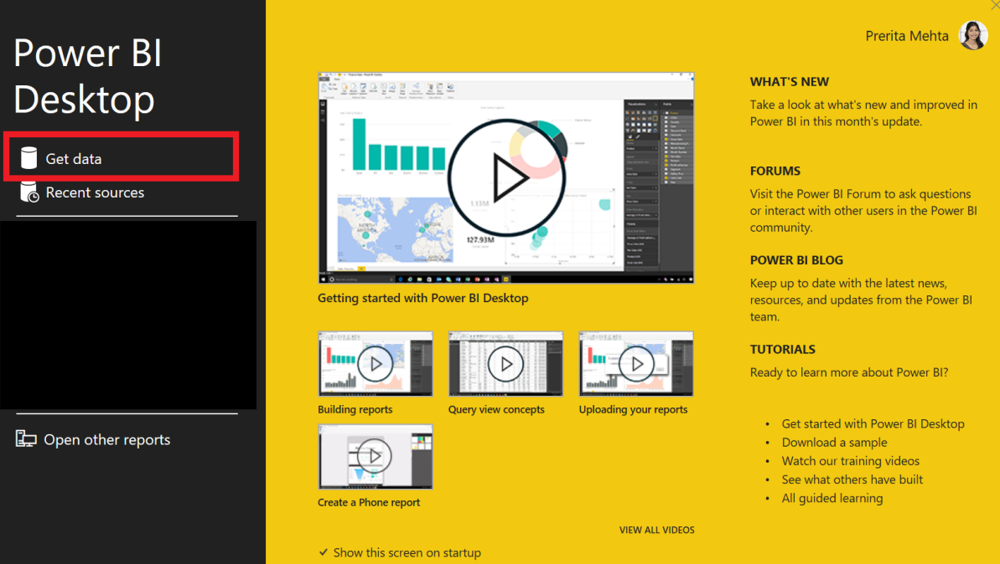
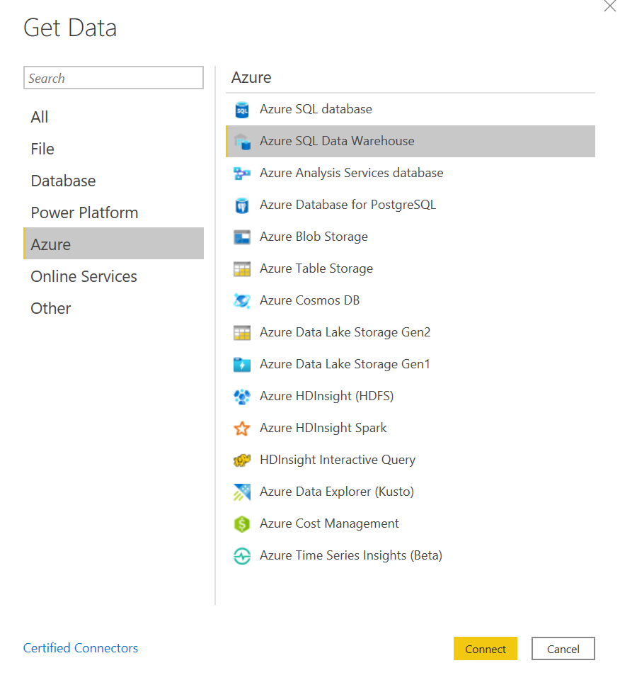
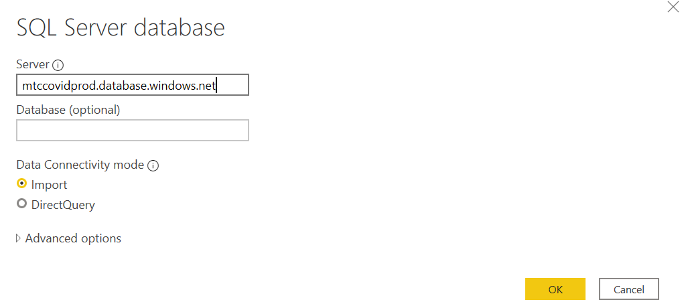
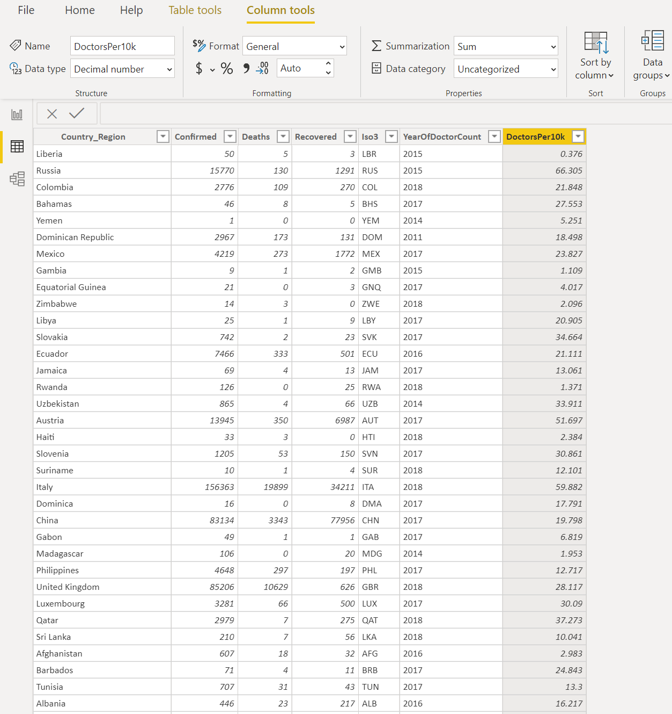
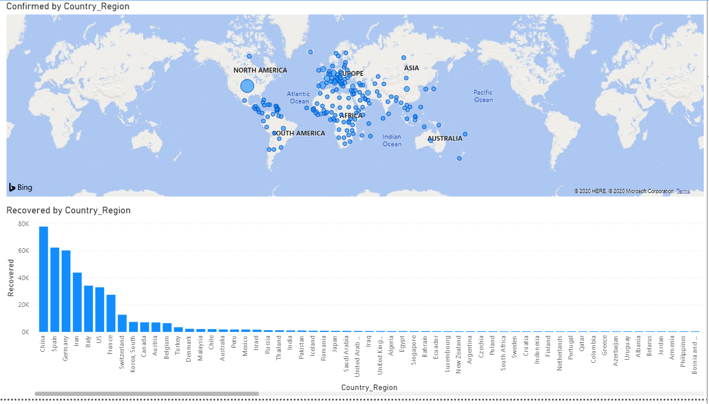

Hands On Lab

MODULE III: DATA ANALYSIS

**MODULE 3:**

Data Analysis with Power BI

Pre-requisites:

  - Azure subscription with Power BI desktop, Power BI Online and R

**Creating a Power BI Desktop Report**

1.  Open the Power BI Desktop application and select Get Data

2.  Select data source: Select ‘Azure’ in the menu and select ‘Azure SQL
    Data Warehouse’

3.  Select database: Input the URL for the database and name of the
    database where view is residing: mtccovidprod.database.windows.net

4.  When prompted for credentials, navigate to the database tab on the
    left hand side and input the following:

Username: Covidhack

Password: iloveData\!

5.  After a few seconds, your data should be loaded in PowerBI in the
    Data tab.

6.  **Note**: Remember to set the ‘Data Type’ for cases to whole numbers
    and the data type for Doctors per 10k to decimal numbers. Set
    Country\_Region to Location.

7.  Navigate to the Report type to start building out your
    visualisations. Some examples of visualisations are shown below.

