Hands On Lab

Pre-requisites: Azure Access

# Objective: Create Azure free trial account 

All you need is a phone number, a credit card, and a GitHub account or
Microsoft account username (formerly Windows Live ID) to get started
with an Azure free trial\!

1.  Navigate to <https://azure.microsoft.com/en-au/free/> and click
    **Start for free**.

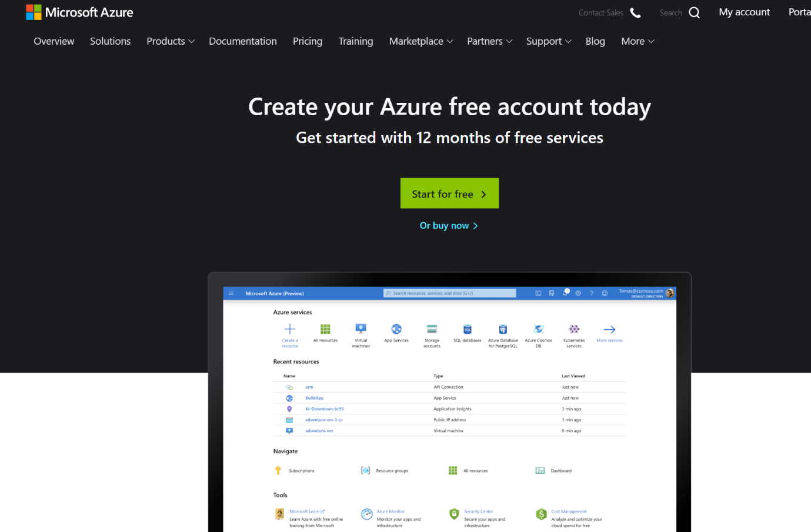

2.  You will be prompted to enter your personal email credentials as
    shown below:

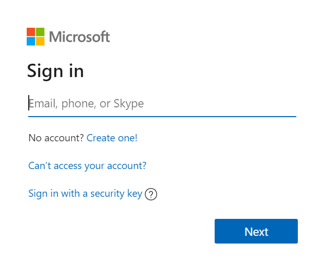

3.  After logging in, fill out all details on the following screen to
    get your free trial account up and running\!

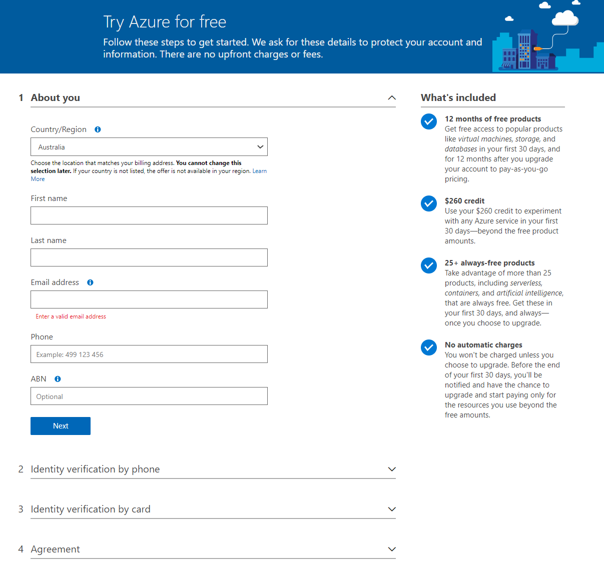

4.  The following screen is shown when your information has been
    verified and your free trial account has been successfully created.

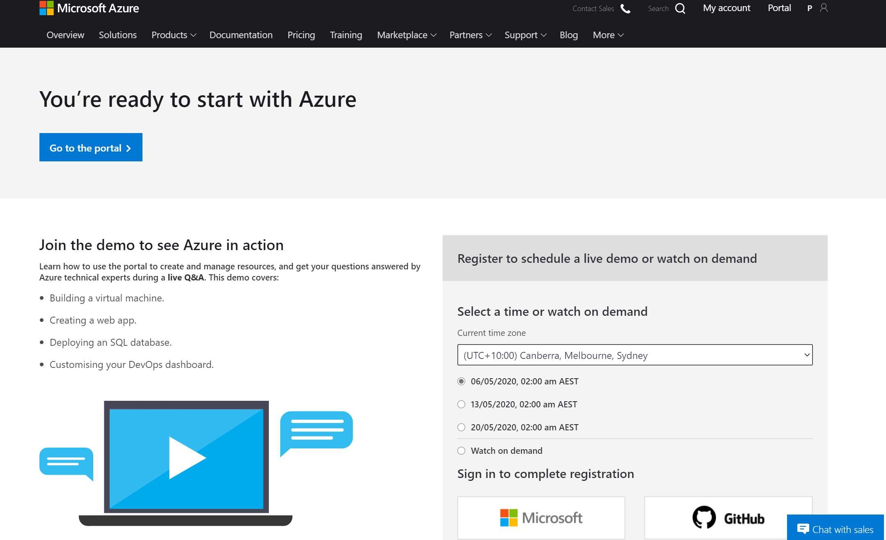

5.  You will also receive a welcome email in your inbox.

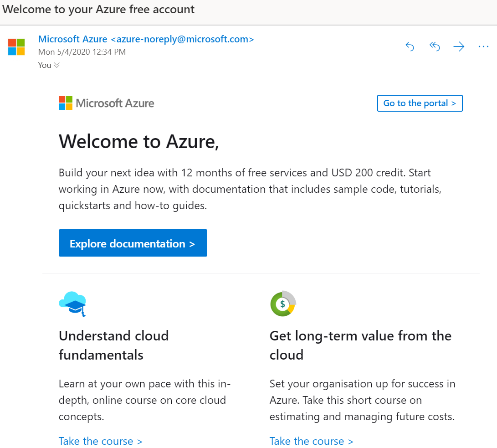

6.  You will shortly receive another email in your inbox, to access the
    **COVIDHackProd resource group** we will be utilising throughout
    this workshop

7.  After successfully signing in to your account, you will be
    redirected to the homepage of the Azure portal. At this stage ensure
    that your directory is set to your **personal account** that you
    have used to sign up for Azure’s free trial. If the email shown is
    not the correct account, please **change directories to Microsoft**.

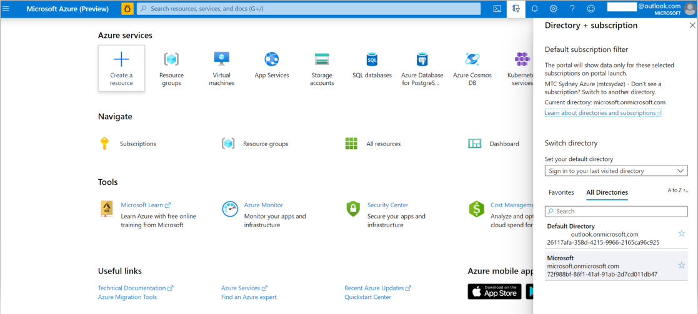

8.  To access the **COVIDHackProd resource group**, click on the
    **resources group icon** on the homepage

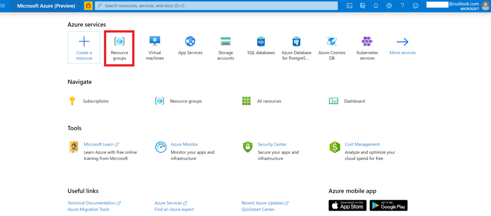

9.  At this stage, you will be redirected to the following page, showing
    you all your available resource groups.

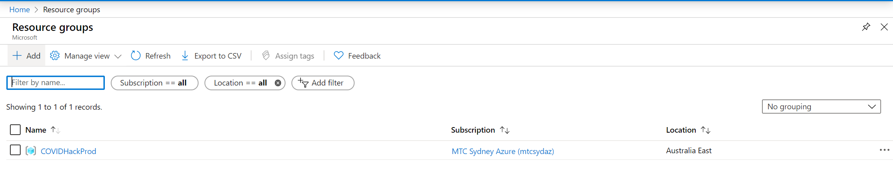

10. Click on the name of the resource group, **COVIDHackProd** and
    ensure you see the following resources in your resource group:

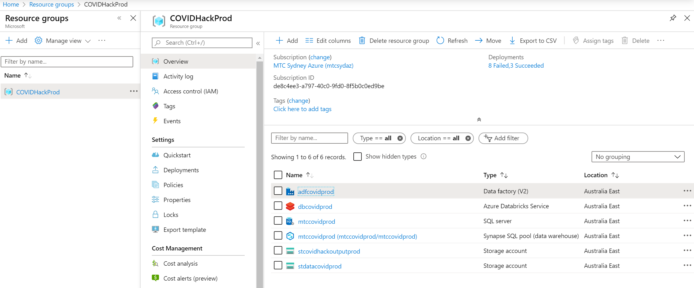

11. The first module in our Data Platforms will focus on creating
    pipelines in Azure Data Factory. **Click** on the **Azure Data
    Factory resource** named **adfcovidprod**. This will redirect you to
    the following page.

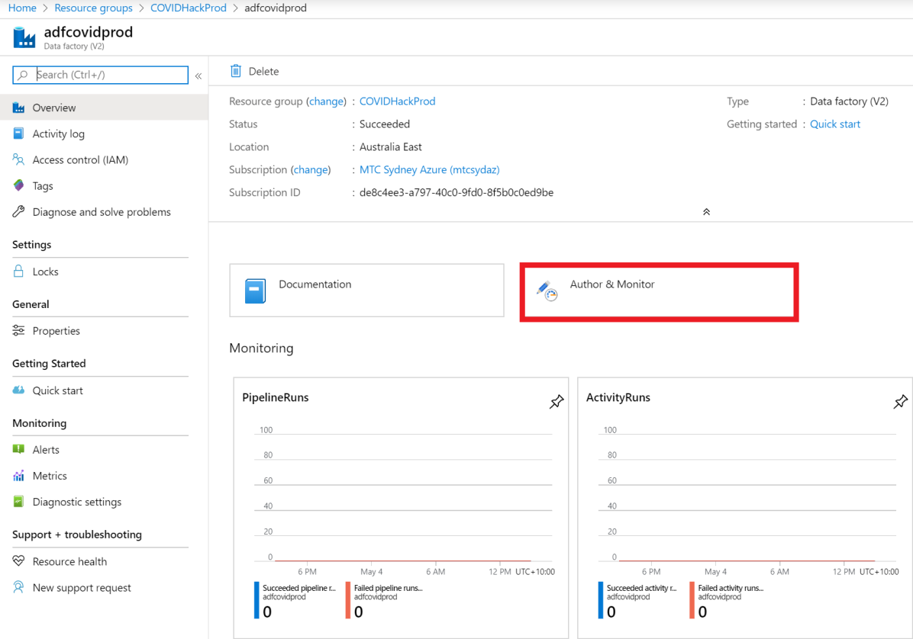

12. **Click** on **Author & Monitor**. This will redirect you to the
    **homepage** of **Azure Data Factory.** This will be your starting
    point for the first workshop.

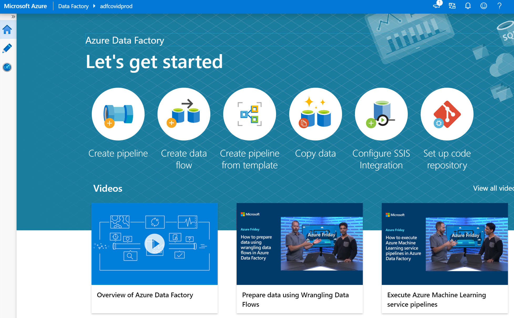
