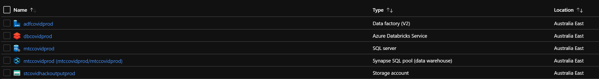

Hands On Lab

SETUP

# Create the Required Resources in your preferred region.

## Data Factory. 

## Databricks cluster. 

## We used the default setup but set autoscaling to upto 8 nodes and 300 mins for the allowed idle time before terminating. 

## Storage account 

## setup as a data lake gen 2 storage.

## Synapse DW.

##  Scale down to 100 DWU. 

# Setup the Databricks cluster

## Mount the Lake as local storage using the provided notebook

## Get an access token for your user. You’ll need this when configuring the final pipeline.

# Follow the workshop instructions

## Create the first three Data Factory Artifacts.

## Run the notebook provided

## Create the fourth pipeline

## Build the Dashboard

## Build the final pipeline making changes as required.

## Update the dashboard

# Create Guest Users using the office 365 subscription linked to your MTC. 

# Activate an org wide azure subscription from within the office subscription. 

# Add Azure subscription rights to the guest users. 

# Create and accept the Invites to the Azure Resource Group for each Guest User from within your resource group.

# Virtual Workshop Best practices

## 1 helper per 4 people is advised. 

## Have 3 speakers

1.  Speaker 1 is the main session facilitator who does the introduction,
    and next steps along with re-iterations of specific concepts.

2.  Speaker 2 is the person who runs the actual hands on.
    
    1.  For virtual sessions, pick one user, preferably the one with the
        least experience in Azure and get them to share their screen and
        walk them through the workshop while the rest follow on their
        systems. This sets the speed for the workshop.
    
    2.  For 10 minutes of hands on (at a regular CSA speed. You need
        about 2 hours in total of workshop time everything included.
    
    3.  Some basic slides are provided for your reference, but limit
        teaching time to a max of 30 minutes for every 2 hour segment.

3.  Speaker 3
    
    1.  Acts as a second speaker for the teaching sets. This also gives
        the other speakers to prep for the next piece.

## Most organizations seem to be locked down and cant access our teams or azure easily. This is why we create ready-to-go and reusable guestusers. Still need to test access with a friendly. 

## Power BI Desktop wont install on a Mac and some users may need to alerted to that. You need a windows machine to play. 

## Mixing it up with additional demos in the last session sets the stage for what they could with this amazing template.
